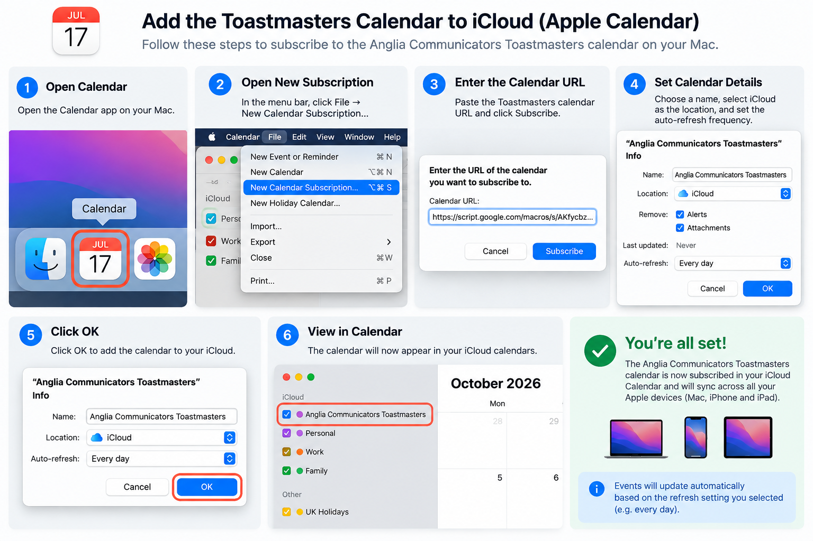
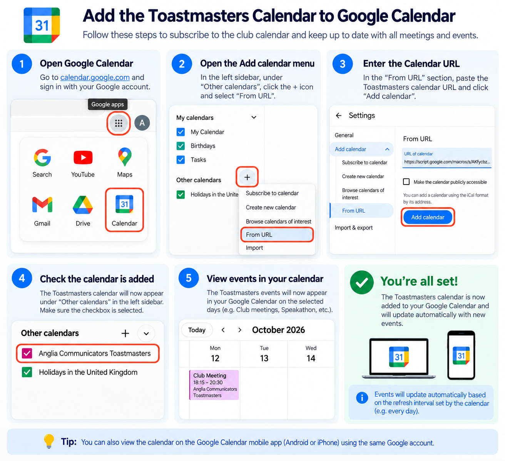

# Toastmasters Club 3380 – Automated Apple Calendar Integration

An automated cloud-based calendar integration for **Anglia Communicators Toastmasters Club #3380** in Peterborough, UK.

The solution retrieves upcoming Toastmasters meetings from the club's JSON feed, transforms the data into an iCalendar (ICS) feed, and makes it available as a subscription for Apple Calendar.

The automation runs in Google Apps Script, so the solution continues to operate even when my Mac is switched off.

---

## Architecture

```text
┌─────────────────────────────────────┐
│ Anglia Communicators Toastmasters   │
│ Meeting JSON Feed                   │
└──────────────────┬──────────────────┘
                   │
                   │ HTTPS / JSON
                   ▼
┌─────────────────────────────────────┐
│ Google Apps Script                  │
│                                     │
│ • Fetch meeting data                │
│ • Filter past meetings              │
│ • Sort upcoming meetings            │
│ • Generate iCalendar (ICS)          │
│ • Handle UK date/time conversion    │
└──────────────────┬──────────────────┘
                   │
                   │ iCalendar feed
                   ▼
┌─────────────────────────────────────┐
│ Apple Calendar                      │
│                                     │
│ • Calendar subscription             │
│ • Daily automatic refresh           │
└─────────────────────────────────────┘

## 📅 Calendar Setup

### 🍎 Apple / iCloud Calendar

Follow the steps in the guide below to add the Toastmasters calendar to Apple Calendar and sync it through iCloud.



### 📅 Google Calendar

Follow the guide below to add the Toastmasters calendar to Google Calendar. Once added, it can also be viewed through the Google Calendar mobile app on Android or iPhone.

